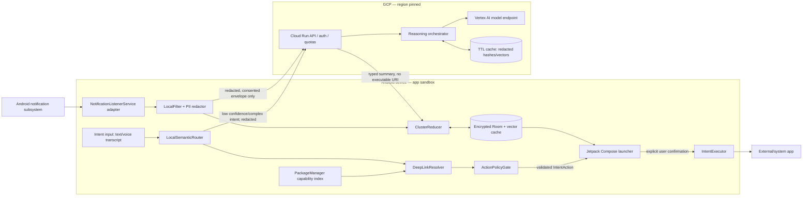

# Project Zero — System Design and Agentic Implementation Backlog

**Status:** implementation baseline  
**Target:** Android 15 baseline behavior; support Android 10+ (`minSdk 29`)  
**Architecture owner:** Mobile / Distributed AI  
**Normative language:** **MUST**, **MUST NOT**, **SHOULD**, and **MAY** are requirements levels.  
**Boundary:** this document specifies contracts and behavior, not production implementation.

**Hardening requirements:** [RELIABILITY_SECURITY.md](RELIABILITY_SECURITY.md) defines mandatory controls H01–H20, their owning tasks, and acceptance evidence. Its explicit corrections govern older illustrative examples in this SDD. These are design requirements, not implemented security or reliability claims.

**Implementation status (2026-09-16):** a compilable blank Compose shell exists in `android-client`; full Task 1 acceptance remains incomplete. See [the handoff guide](IMPLEMENTATION_HANDOFF.md) for evidence, remaining work, and contract gaps. [BACKLOG.md](BACKLOG.md) follows section 5 and replaces the earlier conflicting sequence. Android build/module paths below are relative to `android-client`; backend, repository documentation, and CI paths are repository-relative.

## 0. Decisions, assumptions, and hard boundaries

| ID | Decision |
|---|---|
| D-01 | The launcher is the selected Android home app (`CATEGORY_HOME`/`CATEGORY_DEFAULT`). It is not a device-owner app. |
| D-02 | Notification ingestion uses `NotificationListenerService` only after explicit user grant in system settings. Raw notification content is local by default. |
| D-03 | Project Zero MUST NOT request or implement `AccessibilityService`, screen scraping, simulated taps, hidden APIs, or arbitrary background app launches. |
| D-04 | Every external action is executed with documented Android APIs: explicit/package-scoped intents, verified App Links, registered deep links, or system contract intents. The target app or Android owns the confirmation UI. |
| D-05 | A language model may propose a typed action, but it can never execute one. `ActionPolicyGate` validates it against a versioned allowlist and `PackageManager` before user confirmation. |
| D-06 | Sending, purchasing, deleting, calling, sharing sensitive data, or committing a calendar event is never silent. Project Zero opens a target-owned/system confirmation surface. |
| D-07 | Cloud Run compute is stateless; durable admission/idempotency state uses transactional persistence. Server data is pseudonymous, encrypted, region-pinned, and TTL-bound. Only eligible redacted content may be uploaded after consent; consent never authorizes raw notification upload. |
| D-08 | No general-purpose plugin can supply an arbitrary URI. A signed, versioned deep-link registry is data, not executable code; its parameters are encoded by typed builders. |
| D-09 | Notification summaries are assistive and lossy. The original notification remains authoritative and is opened through its creator-supplied `PendingIntent` only after a user gesture. |

### 0.1 Goals and non-goals

**Goals:** glanceable clustered notifications; natural-language action drafting; deterministic app selection; offline core behavior; bounded cloud cost; auditable privacy decisions.

**Non-goals:** interacting with controls inside other apps; bypassing target-app confirmation; reading message history from other apps; guaranteeing an uncontracted third-party deep link; replacing emergency dialer behavior; cloud training on user data.

### 0.2 Trust zones

1. **Android private zone:** Room database, DataStore preferences, notification text, installed-app capability index, local embeddings.
2. **Android IPC boundary:** untrusted inbound `StatusBarNotification`, `Intent`, URI, `PendingIntent`, and package metadata. Normalize and validate all fields.
3. **Network boundary:** TLS 1.3 preferred/TLS 1.2 minimum, Play Integrity verdict, short-lived installation token, request nonce, and schema version.
4. **Cloud project:** authenticated Cloud Run ingress, policy service, inference adapter, ephemeral cache, metrics with no user text.
5. **External app boundary:** only resolved Android intents cross it; user sees the system chooser or target-owned UI.

---

## 1. Component architecture and sequences

### 1.1 Logical component map



### 1.2 Notification-to-UI sequence

```mermaid
sequenceDiagram
  autonumber
  participant OS as Android notification subsystem
  participant NL as NotificationListener adapter
  participant F as LocalFilter
  participant C as ClusterReducer
  participant V as Local vector/cache store
  participant B as Cloud Run API
  participant SC as Server cache
  participant M as Vertex AI
  participant UI as Compose UI

  OS->>NL: onNotificationPosted(StatusBarNotification)
  NL->>NL: copy allowed primitives; discard RemoteViews
  NL->>F: NotificationEvent(source=LOCAL_CAPTURE)
  F->>F: eligibility, normalize, PII tags, sensitivity
  alt blocked, secret, OTP, payment, health, or work-policy restricted
    F->>C: local-only event or DROP(reason)
  else local summarizer sufficient
    F->>V: lookup embedding/summary by contentFingerprint
    V-->>C: cached/local summary
  else cloud eligible AND opt-in AND network/budget available
    F->>B: POST /v1/summary:batch (redacted fields, nonce, deadline)
    B->>B: authenticate, replay check, quota, schema validation
    B->>SC: installation-scoped template lookup
    alt cache miss
      B->>M: constrained JSON generation
      M-->>B: candidate clusters
      B->>B: validate schema, safety, source membership
    end
    B-->>C: SummaryBatchResponse
  else cloud unavailable or deadline exceeded
    F->>C: deterministic local fallback summary
  end
  C->>C: reconcile by eventId + revision; reject stale result
  C->>V: transactional upsert and expiry
  C-->>UI: Flow<List<SummarizedCluster>>
  UI->>UI: render; redact on lock screen
```

**Ordering rule:** event revision tracks one notification lifecycle; a separate persistent personal-profile snapshotRevision advances for every accepted notification mutation. Request/response baseRevision refers to the snapshot. Pending requestId is bound locally to dataEpoch and snapshotRevision; apply only if both remain current and every member remains live and eligible. Removal invalidates membership/work; erase or revocation advances dataEpoch. Reposts after removal receive a new eventId. See H02 for duplicate and reconnect behavior.

### 1.3 User-intent-to-external-action sequence

```mermaid
sequenceDiagram
  autonumber
  actor U as User
  participant UI as Compose UI
  participant R as LocalSemanticRouter
  participant B as Cloud Run reasoning (optional)
  participant D as DeepLinkResolver
  participant P as ActionPolicyGate
  participant PM as PackageManager
  participant E as IntentExecutor
  participant A as Android/target app

  U->>UI: text or on-device speech transcript
  UI->>R: route(query, affinity, locale)
  alt supported grammar and confidence >= 0.82
    R-->>D: ParsedIntent
  else cloud allowed, redaction succeeds, budget available
    R->>B: typed slots + minimum redacted text
    B-->>R: ParsedIntent candidates + confidence
    R-->>D: candidate (never an executable URI)
  else
    R-->>UI: Clarification(requiredSlots)
  end
  D->>PM: queryIntentActivities(candidate intents)
  PM-->>D: exported, enabled handlers
  D->>D: rank registry > verified web > system generic
  D->>P: IntentAction candidate
  P->>P: allowlist, parameter, package, scheme, risk checks
  alt invalid, ambiguous, or confidence below threshold
    P-->>UI: clarification or safe chooser proposal
  else valid
    P-->>UI: immutable preview + confirmation requirement
    U->>UI: confirm
    UI->>E: execute(actionId, previewDigest)
    E->>PM: resolve again (TOCTOU defense)
    E->>A: startActivity documented intent
    A-->>U: target/system UI; user completes action
  end
```

`IntentExecutor` MUST reject execution if the action expired (five minutes), the preview digest differs, the device is locked for a sensitive action, resolution changed, or confirmation is missing.

### 1.4 Normative state machines

**Notification work item**

| Current state | Event / guard | Next state | Required side effect |
|---|---|---|---|
| `OBSERVED` | duplicate `eventId+revision` | terminal `NO_OP` | None. |
| `OBSERVED` | valid new revision | `FILTERING` | Persist minimal local record transactionally. |
| `FILTERING` | prohibited/expired | terminal `DROPPED` | Delete content; retain only aggregate reason metric. |
| `FILTERING` | local rule/cache/model selected | `LOCAL_REDUCING` | Cancel any older work for the event. |
| `FILTERING` | all cloud gates pass | `CLOUD_PENDING` | Enqueue one coalesced, unique work item. |
| `CLOUD_PENDING` | opt-out/removal/new revision | terminal `CANCELLED` | Cancel request and tombstone old revision. |
| `CLOUD_PENDING` | deadline/error/budget failure | `LOCAL_REDUCING` | Open/update circuit as applicable. |
| `CLOUD_PENDING` | valid matching response | `RECONCILING` | Validate schema, membership, revision, and expiry. |
| `LOCAL_REDUCING` | valid result | `RECONCILING` | Mark origin accurately. |
| `RECONCILING` | stale/missing member | terminal `DISCARDED` | Never resurrect removed content. |
| `RECONCILING` | transaction commits | terminal `PUBLISHED` | Emit updated Room `Flow`. |

**Action proposal**

| Current state | Event / guard | Next state | Required side effect |
|---|---|---|---|
| `CAPTURED` | parse succeeds | `PARSED` | Store request only in memory. |
| `CAPTURED` | unsupported/low confidence | terminal `CLARIFY_OR_REJECT` | Display missing/ambiguous fields. |
| `PARSED` | resolver finds candidate(s) | `RESOLVED` | Freeze typed parameters. |
| `PARSED` | no handler | terminal `UNAVAILABLE` | Offer only matrix-defined fallback. |
| `RESOLVED` | policy denies | terminal `REJECTED` | Emit stable reason code. |
| `RESOLVED` | policy allows | `PREVIEWED` | Compute digest over canonical action and render it. |
| `PREVIEWED` | edit/back/timeout/lock | terminal `CANCELLED` | Invalidate proposal; no launch. |
| `PREVIEWED` | user confirms and all execution guards pass | `EXECUTING` | Resolve once more, consume confirmation atomically, then attempt launch at most once. |
| `EXECUTING` | `startActivity` accepted | terminal `HANDED_OFF` | Record non-sensitive outcome only. |
| `EXECUTING` | resolution/security failure | terminal `FAILED_SAFE` | Do not try a broader implicit intent automatically. |
| `EXECUTING` | launch outcome cannot be established | terminal `OUTCOME_UNKNOWN` | No automatic replay; a new explicit user request is required. |

All transitions are compare-and-set by `eventId+revision` or `actionId`. Terminal states cannot transition. Process restoration may restore `PUBLISHED` display data but MUST NOT restore a `PREVIEWED` action as executable; the user must reissue it.

---

## 2. Data contracts and interfaces

### 2.1 Kotlin domain contracts

These are signatures and invariants; Android framework types MUST remain in adapter modules.

```kotlin
@JvmInline value class EventId(val value: String)       // UUIDv7, unique per post instance
@JvmInline value class ClusterId(val value: String)     // UUIDv7
@JvmInline value class ActionId(val value: String)      // UUIDv7

enum class Sensitivity { PUBLIC, PERSONAL, SECRET }
enum class NotificationKind { MESSAGE, SOCIAL, CALENDAR, DELIVERY, MEDIA, SYSTEM, OTHER }

data class NotificationEvent(
    val schemaVersion: Int,                 // exactly 1
    val eventId: EventId,
    val revision: Long,                     // >= 1; increases on update
    val postedAtEpochMs: Long,
    val observedAtEpochMs: Long,
    val sourcePackage: String,
    val sourceUserSerial: Long,             // local only; never Android user handle
    val channelIdHash: String?,              // base64url SHA-256 with install salt
    val kind: NotificationKind,
    val title: String?,                     // max 160 Unicode code points
    val body: String?,                      // max 2,000 code points
    val peopleTokens: Set<String>,          // local opaque contact tokens, max 16
    val groupKeyHash: String?,
    val isOngoing: Boolean,
    val isClearable: Boolean,
    val sensitivity: Sensitivity,
    val contentFingerprint: String,         // HMAC-SHA256 over normalized content
    val expiresAtEpochMs: Long
)

data class SummarizedCluster(
    val schemaVersion: Int,
    val clusterId: ClusterId,
    val baseRevision: Long,
    val memberEventIds: List<EventId>,       // 1..50, unique
    val headline: String,                    // 1..80 code points
    val summary: String,                     // 1..280 code points
    val kind: NotificationKind,
    val priority: Int,                       // 0..100
    val unreadCount: Int,                    // >= 0
    val generatedBy: SummaryOrigin,
    val confidence: Double,                  // [0.0, 1.0]
    val generatedAtEpochMs: Long,
    val expiresAtEpochMs: Long
)

enum class SummaryOrigin { RULE, LOCAL_MODEL, CLOUD_MODEL, CACHE }

data class AppAffinityContext(
    val schemaVersion: Int,
    val capability: ActionCapability,
    val rankedPackages: List<PackageAffinity>, // max 8; local unless user syncs settings
    val updatedAtEpochMs: Long
)

data class PackageAffinity(
    val packageName: String,
    val userPinned: Boolean,
    val successfulLaunches30d: Int,
    val lastUsedAtEpochMs: Long?,
    val score: Double                         // normalized [0.0, 1.0]
)

enum class ActionCapability {
    MESSAGE, NAVIGATE, CREATE_CALENDAR_EVENT, DIAL, EMAIL, WEB_SEARCH, OPEN_APP
}

sealed interface ActionParameter {
    val key: String
    data class Text(override val key: String, val value: String) : ActionParameter
    data class UriValue(override val key: String, val value: String) : ActionParameter
    data class InstantValue(override val key: String, val epochMs: Long, val zoneId: String) : ActionParameter
    data class StringList(override val key: String, val values: List<String>) : ActionParameter
}

enum class FallbackResolution { NONE, VERIFIED_WEB_LINK, SYSTEM_GENERIC_INTENT, ANDROID_CHOOSER }
enum class Confirmation { PREVIEW_REQUIRED, TARGET_APP_OWNS_COMMIT }

data class IntentAction(
    val schemaVersion: Int,
    val actionId: ActionId,
    val capability: ActionCapability,
    val androidAction: String,               // policy allowlisted constant
    val targetPackage: String?,              // exact installed package or null for chooser
    val uriScheme: String?,                  // policy allowlisted; never inferred free-form
    val registryEntryId: String?,            // immutable registry version + entry
    val parameters: List<ActionParameter>,   // typed; duplicate keys forbidden
    val fallbackResolution: FallbackResolution,
    val confirmation: Confirmation,
    val rationale: String,                   // safe display text, max 160 code points
    val createdAtEpochMs: Long,
    val expiresAtEpochMs: Long               // <= created + 5 minutes
)

sealed interface RouteResult {
    data class Proposed(val action: IntentAction, val confidence: Double) : RouteResult
    data class Clarification(val prompt: String, val requiredSlots: Set<String>) : RouteResult
    data class Unsupported(val reasonCode: String) : RouteResult
}

interface NotificationIngestor { fun events(): kotlinx.coroutines.flow.Flow<NotificationEvent> }
interface NotificationFilter { suspend fun evaluate(event: NotificationEvent): FilterDecision }
interface SummaryEngine { suspend fun summarize(events: List<NotificationEvent>): List<SummarizedCluster> }
interface SemanticRouter { suspend fun route(text: String, context: AppAffinityContext): RouteResult }
interface DeepLinkResolver { suspend fun resolve(parsed: ParsedIntent, context: AppAffinityContext): RouteResult }
interface ActionPolicyGate { suspend fun validate(action: IntentAction): PolicyDecision }
interface ActionExecutor { suspend fun execute(action: IntentAction, previewDigest: String): ExecutionResult }
```

`FilterDecision`, `ParsedIntent`, `PolicyDecision`, and `ExecutionResult` are sealed result types and MUST contain machine-readable reason codes. Exceptions are reserved for programmer or infrastructure faults, never normal ambiguity.

### 2.2 JSON Schema: notification summary request/response

The canonical REST encoding is UTF-8 JSON, camelCase, and integer epoch milliseconds in bodies. Requests and model outputs reject unknown fields. Compatible response readers may ignore unknown non-executable envelope metadata, but action/slot objects remain closed. Missing required values fail validation. Server responses must satisfy the current strict producer schema shown below. Authentication appears only in headers/metadata. Bodies are limited to 64 KiB compressed and 256 KiB expanded, enforced during streaming. H04 defines presence, numeric, and REST/protobuf equivalence rules.

```json
{
  "$schema": "https://json-schema.org/draft/2020-12/schema",
  "$id": "https://projectzero.example/schemas/v1/summary-batch-request.json",
  "title": "SummaryBatchRequest",
  "type": "object",
  "additionalProperties": false,
  "required": ["schemaVersion", "requestId", "baseRevision", "locale", "events"],
  "properties": {
    "schemaVersion": { "const": 1 },
    "requestId": { "type": "string", "format": "uuid" },
    "baseRevision": { "type": "integer", "minimum": 1 },
    "locale": { "type": "string", "pattern": "^[A-Za-z]{2,3}(-[A-Za-z0-9]{2,8})*$" },
    "events": {
      "type": "array", "minItems": 1, "maxItems": 50,
      "items": {
        "type": "object", "additionalProperties": false,
        "required": ["eventId", "kind", "redactedTitle", "redactedBody", "contentFingerprint"],
        "properties": {
          "eventId": { "type": "string", "format": "uuid" },
          "kind": { "enum": ["MESSAGE", "SOCIAL", "CALENDAR", "DELIVERY", "MEDIA", "SYSTEM", "OTHER"] },
          "redactedTitle": { "type": ["string", "null"], "maxLength": 160 },
          "redactedBody": { "type": ["string", "null"], "maxLength": 2000 },
          "contentFingerprint": { "type": "string", "pattern": "^[A-Za-z0-9_-]{43}$" }
        }
      }
    }
  }
}
```

```json
{
  "$schema": "https://json-schema.org/draft/2020-12/schema",
  "$id": "https://projectzero.example/schemas/v1/summary-batch-response.json",
  "title": "SummaryBatchResponse",
  "type": "object",
  "additionalProperties": false,
  "required": ["schemaVersion", "requestId", "baseRevision", "clusters", "usage"],
  "properties": {
    "schemaVersion": { "const": 1 },
    "requestId": { "type": "string", "format": "uuid" },
    "baseRevision": { "type": "integer", "minimum": 1 },
    "clusters": {
      "type": "array", "maxItems": 50,
      "items": {
        "type": "object", "additionalProperties": false,
        "required": ["clusterId", "memberEventIds", "headline", "summary", "kind", "priority", "confidence", "expiresAtEpochMs"],
        "properties": {
          "clusterId": { "type": "string", "format": "uuid" },
          "memberEventIds": { "type": "array", "minItems": 1, "maxItems": 50, "uniqueItems": true, "items": { "type": "string", "format": "uuid" } },
          "headline": { "type": "string", "minLength": 1, "maxLength": 80 },
          "summary": { "type": "string", "minLength": 1, "maxLength": 280 },
          "kind": { "enum": ["MESSAGE", "SOCIAL", "CALENDAR", "DELIVERY", "MEDIA", "SYSTEM", "OTHER"] },
          "priority": { "type": "integer", "minimum": 0, "maximum": 100 },
          "confidence": { "type": "number", "minimum": 0, "maximum": 1 },
          "expiresAtEpochMs": { "type": "integer", "minimum": 0 }
        }
      }
    },
    "usage": {
      "type": "object", "additionalProperties": false,
      "required": ["cacheHit", "inputTokens", "outputTokens"],
      "properties": {
        "cacheHit": { "type": "boolean" },
        "inputTokens": { "type": "integer", "minimum": 0 },
        "outputTokens": { "type": "integer", "minimum": 0 }
      }
    }
  }
}
```

### 2.3 JSON Schema: typed intent reasoning

Cloud reasoning returns slots, never `androidAction`, package, deep link, or executable URI. This prevents the model from expanding execution authority.

```json
{
  "$schema": "https://json-schema.org/draft/2020-12/schema",
  "$id": "https://projectzero.example/schemas/v1/intent-route.json",
  "$defs": {
    "slots": {
      "type": "object", "additionalProperties": false,
      "properties": {
        "recipientToken": { "type": "string", "maxLength": 128 },
        "message": { "type": "string", "maxLength": 2000 },
        "destination": { "type": "string", "maxLength": 300 },
        "title": { "type": "string", "maxLength": 160 },
        "startEpochMs": { "type": "integer", "minimum": 0 },
        "endEpochMs": { "type": "integer", "minimum": 0 },
        "zoneId": { "type": "string", "maxLength": 64 },
        "query": { "type": "string", "maxLength": 500 }
      }
    }
  },
  "oneOf": [
    {
      "title": "IntentRouteRequest", "type": "object", "additionalProperties": false,
      "required": ["schemaVersion", "requestId", "locale", "capabilityHints", "redactedText"],
      "properties": {
        "schemaVersion": { "const": 1 },
        "requestId": { "type": "string", "format": "uuid" },
        "locale": { "type": "string" },
        "capabilityHints": { "type": "array", "maxItems": 7, "items": { "enum": ["MESSAGE", "NAVIGATE", "CREATE_CALENDAR_EVENT", "DIAL", "EMAIL", "WEB_SEARCH", "OPEN_APP"] } },
        "redactedText": { "type": "string", "minLength": 1, "maxLength": 2000 }
      }
    },
    {
      "title": "IntentRouteResponse", "type": "object", "additionalProperties": false,
      "required": ["schemaVersion", "requestId", "capability", "slots", "missingSlots", "confidence"],
      "properties": {
        "schemaVersion": { "const": 1 },
        "requestId": { "type": "string", "format": "uuid" },
        "capability": { "enum": ["MESSAGE", "NAVIGATE", "CREATE_CALENDAR_EVENT", "DIAL", "EMAIL", "WEB_SEARCH", "OPEN_APP"] },
        "slots": { "$ref": "#/$defs/slots" },
        "missingSlots": { "type": "array", "uniqueItems": true, "items": { "type": "string" } },
        "confidence": { "type": "number", "minimum": 0, "maximum": 1 }
      }
    }
  ]
}
```

### 2.4 REST and gRPC transport contract

| Operation | REST | gRPC | Deadline | Idempotency |
|---|---|---|---:|---|
| Batch summary | `POST /v1/summary:batch` | `ReasoningService.Summarize` | 4 s client / 3 s server | `requestId`, retained 10 min |
| Intent parsing | `POST /v1/intents:route` | `ReasoningService.RouteIntent` | 2.5 s client / 2 s server | `requestId`, retained 10 min |
| Registry manifest | `GET /v1/registry?version=` | `RegistryService.GetRegistry` | 3 s | ETag/version |

Required headers: `Authorization: Bearer <installation-token>`, `X-Request-Id`, `X-Schema-Version: 1`, `X-Client-Version`, `X-Nonce`, `X-Sent-At` (RFC 3339 UTC), and `Content-Encoding: gzip` when compressed. Nonces/timestamps identify bounded-age transport attempts; requestId identifies an idempotent logical operation. H09–H10 govern authentication, replay, and durable reservations. Reasoning responses use `Cache-Control: no-store` and `X-Trace-Id`; summary responses include `usage` as defined below, and route usage is maintained in the server ledger. Never log authorization, nonce, raw text, slots, titles, bodies, or URIs. Protobuf below is illustrative: Task 1 must complete registry messages and typed presence validation under H04 before claiming contract conformance.

```proto
syntax = "proto3";
package projectzero.reasoning.v1;

service ReasoningService {
  rpc Summarize(SummaryBatchRequest) returns (SummaryBatchResponse);
  rpc RouteIntent(IntentRouteRequest) returns (IntentRouteResponse);
}

message SummaryBatchRequest {
  int32 schema_version = 1;
  string request_id = 2;
  int64 base_revision = 3;
  string locale = 4;
  repeated RedactedNotification events = 5;
}
message RedactedNotification {
  string event_id = 1;
  string kind = 2;
  optional string redacted_title = 3;
  optional string redacted_body = 4;
  string content_fingerprint = 5;
}
message SummaryBatchResponse {
  int32 schema_version = 1;
  string request_id = 2;
  int64 base_revision = 3;
  repeated Cluster clusters = 4;
  Usage usage = 5;
}
message Cluster {
  string cluster_id = 1;
  repeated string member_event_ids = 2;
  string headline = 3;
  string summary = 4;
  string kind = 5;
  int32 priority = 6;
  double confidence = 7;
  int64 expires_at_epoch_ms = 8;
}
message IntentRouteRequest {
  int32 schema_version = 1;
  string request_id = 2;
  string locale = 3;
  repeated string capability_hints = 4;
  string redacted_text = 5;
}
message IntentRouteResponse {
  int32 schema_version = 1;
  string request_id = 2;
  string capability = 3;
  IntentSlots slots = 4;
  repeated string missing_slots = 5;
  double confidence = 6;
}
message Usage { bool cache_hit = 1; int32 input_tokens = 2; int32 output_tokens = 3; }

message IntentSlots {
  optional string recipient_token = 1;
  optional string message = 2;
  optional string destination = 3;
  optional string title = 4;
  optional int64 start_epoch_ms = 5;
  optional int64 end_epoch_ms = 6;
  optional string zone_id = 7;
  optional string query = 8;
}
```

REST error body and gRPC mapping:

```json
{"schemaVersion":1,"requestId":"uuid","code":"RATE_LIMITED","retryable":true,"retryAfterMs":30000,"message":"Safe display text"}
```

| HTTP | gRPC | Code | Client behavior |
|---:|---|---|---|
| 400 | `INVALID_ARGUMENT` | `SCHEMA_INVALID` | Do not retry; local fallback; metric only. |
| 401/403 | `UNAUTHENTICATED`/`PERMISSION_DENIED` | `AUTH_FAILED` | Refresh once; then local fallback. |
| 409 | `ABORTED` | `STALE_REVISION` | Rebuild once from current local state. |
| 409 | `ALREADY_EXISTS` | `CONFLICT` | Same operation ID with different payload; do not retry with that ID. |
| 429 | `RESOURCE_EXHAUSTED` | `RATE_LIMITED` | Honor delay; local fallback; open circuit after 3. |
| 429 | `RESOURCE_EXHAUSTED` | `BUDGET_EXHAUSTED` | Local fallback; do not retry until the next admitted budget window. |
| 5xx | `UNAVAILABLE` | `UPSTREAM_UNAVAILABLE` | Jittered retry once within deadline, then local fallback. |

Any retry above reuses the logical requestId and obeys H10. A timeout with uncertain provider dispatch never causes another inference merely because a transport retry is allowed. Validation/privacy denial, unsupported schema/locale, clock skew, cancellation, and uncertain outcome require stable reason codes in Task 1's closed error taxonomy and equivalent REST/gRPC behavior.

Auth bootstrap uses challenge-bound, server-verified Play Integrity registration. Scoped tokens last at most 15 minutes, identify a random installation, and include issuer/audience/expiry and revocation checks. Renewal is rate-limited. The public entry point validates application tokens; private service calls use workload IAM identity. H09 makes key rotation/revocation a v1 requirement; account sync remains future scope. Integrity failure disables cloud, never the local launcher.

---

## 3. Intent-to-action resolution matrix

### 3.1 Deterministic resolution algorithm

1. Create a normalized parsing view using Unicode (NFKC), locale, whitespace, and speech punctuation; preserve original message/parameter text separately so normalization does not rewrite user content.
2. Match the versioned local grammar and entity extractors. Required slots and allowable parameter types come from the capability table below.
3. Return clarification if a required slot is absent, time is ambiguous, recipient match is not unique, or top-two capability scores differ by `< 0.12`.
4. For supported grammar, accept a fully specified local candidate at confidence `>= 0.82`; `0.55..0.819` may use cloud under all section 4 gates; below `0.55`, clarify/reject. For unsupported local grammar, a cloud route requires independently validated on-device redaction and cloud support for that locale. H05 defines precedence and calibration.
5. Build candidates exclusively from the signed registry and Android system-contract builders. Never concatenate model text into a URI. Apply `Uri.Builder`, percent encoding, length limits, and scheme/host/path allowlists.
6. Query `PackageManager` using narrowly declared `<queries>` entries. Reject disabled, non-exported, signature-mismatched (where pinned), or unresolvable activities.
7. Rank: user-pinned capable app; then registry-compatible affinity score; then single verified handler; then system generic intent; finally Android chooser. A tie within `0.05` always uses the chooser.
8. Validate through `ActionPolicyGate`, show an immutable preview, collect confirmation where specified, then resolve again immediately before launch.
9. Record only capability, outcome, and coarse latency in telemetry. Package affinity may be stored privately on-device, but selected package is not a telemetry dimension. Never record message, recipient, destination, query, or full URI.

### 3.2 Capability matrix

| Natural-language intent | Required slots | Primary documented contract | Package/deep-link rule | Fallback | Confirmation and failure behavior |
|---|---|---|---|---|---|
| “Message Maya ‘late by 10’” | unique recipient, body | `ACTION_SENDTO` with `smsto:` for SMS; registered provider deep link for WhatsApp-like apps | Provider entry must declare exact package, scheme/host/path template, and typed slot mapping. No generic `ACTION_SEND` when a recipient is required. | `smsto:` system handler, then chooser | Always preview recipient/body. Target app owns Send. Ambiguous contact => clarify. |
| “Text this photo to Maya” | content URI; recipient intent clarified | `ACTION_SEND` + bounded `FileProvider` read grant and MIME type | Only handlers returned for MIME type; generic sharing cannot guarantee recipient addressing. | Android chooser | Preview attachment; target owns recipient selection and Send unless a documented provider contract supports addressing. Grant lifetime follows the tested consumption contract (H03/H13). |
| “Navigate to 21 Market Street” | destination | `ACTION_VIEW` with encoded `geo:0,0?q=…`, or verified provider navigation link | Prefer pinned capable map; coordinates permitted only after local/system geocoding policy. | Generic `geo:` then chooser | Preview destination. No cloud location history. No handler => copy destination offer. |
| “Add dentist tomorrow at 3 for an hour” | title, unambiguous start, end/duration, zone | `CalendarContract.ACTION_INSERT` with `Events.CONTENT_URI` and documented extras | System calendar-capable handlers only; do not write provider directly in v1. | None | Preview interpreted absolute date/time/zone. Calendar UI owns Save. Ambiguous DST/date => clarify. |
| “Call Maya” | unique phone target | `ACTION_DIAL` with `tel:` | Dialer handler; never request direct-call permission for v1. | System dialer | Preview number/contact alias; dialer owns Call. Emergency-like input routes to dialer with warning, never automated. |
| “Email Lee about the report” | unique address, subject/body optional | `ACTION_SENDTO` with `mailto:` and encoded query | Email-capable handlers only. | Chooser | Preview fields; email app owns Send. |
| “Search the web for…” | non-empty query | HTTPS URL to user-selected search provider via `ACTION_VIEW` | Registry host must be HTTPS and allowlisted. | Browser chooser | Preview query/provider for sensitive classification; otherwise one-tap open. |
| “Open Spotify” | unique installed app label/package | `PackageManager.getLaunchIntentForPackage` equivalent launcher intent | Candidate must have enabled exported launcher activity. | App chooser for duplicate labels | No data-changing action. Missing app => show store search only after confirmation. |

### 3.3 Registry contract and safety rules

Each registry entry contains: `registryVersion`, `entryId`, `capability`, `packageName`, optional certificate SHA-256 pins, `minVersionCode`, allowed schemes/hosts/path regexes, typed parameter-to-placeholder mappings, fallback ID, and expiry. The manifest is signed offline; the app ships a trust root and last-known-good registry. Invalid, expired, rolled-back, or incorrectly signed registries are rejected. A remote kill switch can disable an entry but cannot add authority beyond the shipped capability policy.

URI defenses are mandatory: reject `intent:`, `file:`, `javascript:`, embedded credentials, IP-literal hosts, redirects in parameters, CR/LF, nested URIs unless the entry explicitly types them, and decoded output over 4,096 code points. HTTPS fallback must match an allowlisted host and path after parsing, not string-prefix matching.

---

## 4. Optimized local/cloud AI routing

### 4.1 Exact routing policy

Evaluate top to bottom; the first terminal rule wins.

| Priority | Condition | Route |
|---:|---|---|
| 1 | User disabled cloud, notification access is absent for a notification operation, device policy disallows processing, app is in local-only list, or sensitivity is `SECRET` | Local only; never enqueue upload. User-entered intents do not require notification access. |
| 2 | Content matches OTP/auth code, financial amount/account, health, precise location, password/secret, minors policy, or managed-profile boundary | Local deterministic handling; cloud prohibited even if generally opted in. |
| 3 | Action is `DIAL`, `OPEN_APP`, exact local contact match, exact local grammar, or system contract with confidence `>= 0.82` | Local. |
| 4 | Summary fingerprint or intent-template embedding has a valid local cache hit with cosine similarity `>= 0.94` and same locale/model-policy version | Local cached result after membership/slot revalidation. |
| 5 | Network is unmetered or user allowed metered; battery is not critically low; cloud opt-in is active; circuit is closed; daily budget remains; redaction succeeds; and complexity trigger below is true | Cloud. |
| 6 | Any prerequisite fails or deadline would exceed UI budget | Local fallback or clarification; never wait indefinitely. |

**Complexity trigger:** cloud is justified only for (a) 4+ related events requiring abstraction, (b) supported-grammar confidence `0.55..0.819`, (c) temporal reasoning that still satisfies H05 confidence rules, or (d) unsupported local grammar with separately validated on-device redaction and cloud support. No trigger overrides privacy, consent, ambiguity, or budget gates. One obvious command or valid cache hit stays local.

**Redaction:** before upload replace contact identities, phone/email, URLs, precise addresses, account/order IDs, and free-form unique numbers with stable request-scoped placeholders (`<PERSON_1>`). The response is rehydrated only for display slots that existed in the request; the model cannot invent placeholder IDs. If redaction confidence is below `0.98`, cloud routing is denied.

### 4.2 Cache design and invalidation

| Layer | Key | Value | TTL / bound |
|---|---|---|---|
| Device exact | `HMAC(installSalt, normalized content + locale + policyVersion)` | validated summary/route template | 7 days; LRU 20 MiB |
| Device vector | quantized local embedding + locale + capability | template ID and non-sensitive structural slots | 30 days; LRU 10,000 entries |
| Server exact | installation/consent epoch + HMAC of normalized redacted structure and all relevant versions | validated template; current request IDs rebuilt on hit | 24 h; max 64 KiB/value |
| Server semantic | curated public template embedding + locale/version | public template skeleton only; no user-learned cross-installation reuse | 7 days; per-language namespace |

Template caches never contain rehydrated PII, executable actions, or reusable request/event/cluster IDs. Rebuild IDs and placeholder bindings from each current request. Exact hits revalidate membership, expiry, slots, and policy. Semantic hits require calibrated similarity `>=0.94`, capability/slot agreement, and full local validation; similarity grants no authority. H06 defines installation/profile/epoch partitioning and all version keys. Invalidate on relevant version/locale/source/erase changes. Rotate install salt on erase/reinstall and server pepper quarterly, with at most 24 hours of prior-pepper overlap. Rehydrated local display summaries remain subject to H07 retention.

### 4.3 Cost envelope: `< $0.002 / active user / day`

This is a measured total-cost objective supported by enforced admission budgets, not a guarantee about the final cloud invoice. H10–H11 define atomic reservations, uncertain provider outcomes, installation-day accounting, fleet limits, fixed costs, and pricing changes:

* Daily cloud allowance: at most **2 summary batches + 2 route requests**, enforced on the server as well as the client. Only summaries use opportunistic 30-second coalescing; interactive routes use their own deadlines.
* Server token allowance: **4,000 input + 600 output tokens/user/day** after cache hits. Per request: 1,200 input/200 output maximum.
* Hard monetary ledger: reserve **$0.0016** for inference, **$0.0002** for Cloud Run/egress/cache, and **$0.0002** safety margin. The pricing adapter computes projected cost from current configured model/SKU prices before dispatch.
* If `spent + outstandingReservations + projected > $0.0018`, or fleet admission fails, return `BUDGET_EXHAUSTED`; use local fallback. Reserve atomically before provider dispatch and settle conservatively under H10. Reset by server UTC day. A global kill switch lowers allowances when measured cost exceeds the approved envelope.
* Target cache rates: >=70% exact/semantic hit for summaries and >=85% local resolution for actions. Dashboards use aggregate counts only.

`cost = inputTokens*configuredInputRate + outputTokens*configuredOutputRate + allocatedPlatformCost`. Release is blocked unless a load replay using the current price configuration has mean `< $0.002` and p95 `< $0.004` per active-user day. This makes the constraint testable despite price/model changes.

### 4.4 Reliability, privacy, and observability

* Client circuit breaker opens for 15 minutes after three retryable failures in five minutes. WorkManager may batch summaries but MUST NOT retry intent routing after its interaction expires.
* Offline mode retains all deterministic launcher/action features and rule summaries. UI labels cloud-derived content and exposes delete/disable controls.
* Raw local events become inaccessible at 24 hours or removal, whichever is earlier; summaries lose removed members immediately and expire no later than 7 days. H07 distinguishes immediate read/render denial from physical cleanup when execution is available and specifies offline/server deletion. Payloads are excluded from logs, traces, crash reports, analytics, and training; provider retention/residency must also be verified under H16.
* Metrics: request count, coarse latency bucket, error code, route (local/cache/cloud), model/policy version, token counts, and cost micros. Dimensions MUST NOT include installation ID, package name at low volume, content, URI, contact, or slots.
* SLOs: local route p95 <150 ms; cached summary p95 <100 ms; cloud intent p95 <2 s; cloud summary p95 <3 s; crash-free sessions >=99.8%. Cloud failure never prevents home-screen rendering.

---

## 5. Cursor / Antigravity implementation backlog

Only these six tasks define the build sequence. An agent MUST complete task `N` acceptance evidence before task `N+1` starts. A commit alone is not acceptance. The user has now authorized Grok-led work toward all six tasks, staged by evidence. Production deployment and publishing need their own real inputs and verification. Generated code must preserve module boundaries and may not introduce accessibility dependencies.

### Task 1 — Repository foundation and enforceable domain contracts

**Depends on:** none.

**Objective & scope**

Extend the existing Android/Kotlin project into the required modules; create domain types, result/error taxonomy, JSON Schemas, protobuf definitions, and architecture checks. Select version-catalog-pinned dependencies and baseline CI. Preserve the existing blank Compose shell as a scaffold exception; no functional launcher UI, notification access, networking, or model execution belongs in this task.

**Inputs**

* Sections 0 and 2 of this SDD.
* Android application ID and signing configuration supplied out-of-band; secrets must not enter Git.

**Output files/modules**

* `settings.gradle.kts`, root build convention plugins, `gradle/libs.versions.toml`.
* `:domain` Kotlin value objects/interfaces; `:contracts` JSON schemas and `reasoning.proto`.
* `:app` minimal manifest with home intent filter, but no notification listener enabled yet.
* `:architecture-tests`, CI workflow, lint/format/static-analysis configuration.

**Strict acceptance criteria**

1. JVM tests cover every constructor invariant, enum wire value, sealed outcome, timestamp boundary, Unicode length, duplicate parameter, and action expiry.
2. Golden JSON/protobuf compatibility tests round-trip v1, reject missing/extra forbidden fields, and prove deterministic canonicalization.
3. Architecture test fails on Android imports in `:domain` and on dependency cycles.
4. Merged manifest contains no `BIND_ACCESSIBILITY_SERVICE`, `SYSTEM_ALERT_WINDOW`, broad package query, direct call, SMS-send, contacts, or storage permission.
5. `./gradlew check lint test` succeeds on a clean checkout with reproducible dependency locks.

### Task 2 — Local notification ingestion, privacy filter, clustering, and storage

**Depends on:** Task 1 contracts.

**Objective & scope**

Implement the explicit notification-listener onboarding, framework adapter, normalizer, PII/sensitivity classifier, deterministic clustering/fallback summaries, encrypted-at-rest repository, TTL/tombstone logic, and lock-screen redaction. Do not call cloud services.

**Inputs**

* `NotificationEvent`, `SummarizedCluster`, `NotificationIngestor`, `NotificationFilter`, `SummaryEngine`.
* Section 1.2 ordering and section 4 privacy/retention rules.

**Output files/modules**

* `:notification-ingest`, `:local-ai`, `:data-local`, Room schemas/migrations, test fixtures.
* App manifest service protected by `android.permission.BIND_NOTIFICATION_LISTENER_SERVICE` and an in-app education/settings route.

**Strict acceptance criteria**

1. Robolectric/instrumentation tests prove post/update/remove, same-key repost, process death, reboot, listener disconnect, multi-user serial separation, ongoing notification, and out-of-order callback behavior.
2. Property tests prove normalization is idempotent, cluster membership has no duplicates, tombstoned IDs cannot reappear from stale results, and raw retention is <=24 hours.
3. Security tests prove `RemoteViews`, foreign `PendingIntent` metadata, spans, oversized text, OTP, health, finance, and managed-profile content never enter a cloud-eligible object.
4. With listener permission denied/revoked, launcher remains usable and displays a non-blocking explanation.
5. On a locked emulator, secret/personal text does not appear in Compose semantics, snapshots, or logs.

### Task 3 — Deterministic intent router, registry, resolver, and safe executor

**Depends on:** Tasks 1–2.

**Objective & scope**

Implement local grammar/entity parsing, capability index, signed registry verification, affinity ranking, URI builders, policy gate, preview digest, and user-gesture-bound executor for every matrix row. No cloud parsing yet.

**Inputs**

* `AppAffinityContext`, `IntentAction`, routing interfaces, section 3 matrix.
* Offline-signed registry fixture and public trust key.

**Output files/modules**

* `:intent-router`, `:action-resolver`, `:registry`, `:android-executor`.
* Narrow manifest `<queries>` entries and intent-preview UI contract.

**Strict acceptance criteria**

1. Table-driven tests cover every matrix row: exact match, absent handler, multiple handlers, tied affinities, ambiguous contact/date/DST, malformed target metadata, and package removal between preview and launch.
2. Fuzz tests reject all forbidden schemes, path traversal/encoding tricks, nested redirect payloads, CR/LF, oversized values, and template-placeholder injection.
3. Signature tests reject modified, expired, future, rollback, unknown-key, and capability-escalating registries; last-known-good remains operational.
4. Instrumentation with fake exported activities asserts the emitted action, data URI, MIME, flags, package, typed extras, chooser behavior, and one-time URI grants exactly.
5. Static/manifest scan finds no accessibility service, hidden API, broad package visibility, `ACTION_CALL`, direct send API, or simulated input. All data-changing flows require preview and target-owned commit.

### Task 4 — Cloud Run reasoning plane and Android secure client

**Depends on:** Tasks 1–3; local fallbacks must already pass.

**Objective & scope**

Implement opt-in UI, redaction, authenticated REST/gRPC clients, Cloud Run gateway/orchestrator, constrained model adapter, validation, rate/budget controls, caches, and telemetry. Model output remains typed and non-executable.

**Inputs**

* Section 2 wire contracts and section 4 routing/cost policy.
* GCP project/region, Secret Manager references, model SKU price configuration, Play Integrity cloud credentials.

**Output files/modules**

* `:network`, `:cloud-policy`, backend `services/reasoning`, infrastructure-as-code, API conformance suite.
* Data retention/deletion configuration and operational dashboards/alerts.

**Strict acceptance criteria**

1. Contract tests run Android client against backend for REST and gRPC, including v1 unknown-field compatibility and every error mapping.
2. Security tests reject invalid integrity verdicts/tokens, expired tokens, replayed nonce/request IDs, over-limit/decompression-bomb bodies, prompt injection, invented placeholders, and model-created URI/package fields.
3. Tests demonstrate prohibited classifications cause zero network calls; redaction confidence `<0.98` causes local fallback; opt-out deletes queued/cache content and prevents future upload.
4. Fault injection for DNS/TLS/429/5xx/timeout/malformed model JSON/stale revision always returns within deadline and selects local fallback without UI crash.
5. Replay load test with configured current prices reports mean `<$0.002` per active-user day, budget rejection at `$0.0018`, cache targets, and no sensitive fields in logs/traces.

### Task 5 — Compose launcher experience and end-to-end integration

**Depends on:** Tasks 1–4.

**Objective & scope**

Build the minimalist home screen, app list/search, notification clusters, intent input, clarification, immutable action preview, consent/privacy controls, offline/error states, and accessibility for the launcher’s own UI (semantic UI accessibility is allowed; `AccessibilityService` is not).

**Inputs**

* Domain flows and use cases from Tasks 2–4.
* UX tokens/design assets supplied separately.

**Output files/modules**

* `:feature-home`, `:feature-intent`, `:feature-settings`, Compose navigation, screenshot baselines, end-to-end test harness.

**Strict acceptance criteria**

1. Compose tests cover empty/permission-denied/offline/loading/cached/cloud/error/stale states, rotation, process restoration, font scale 200%, RTL, dark theme, and touch targets >=48 dp.
2. End-to-end tests prove notification-to-cluster rendering and each intent-to-preview-to-external-activity flow; cancellation performs no external launch.
3. Sensitive action requires unlocked device, unexpired action, matching preview digest, and fresh resolution. Tests mutate each value and assert rejection.
4. Macrobenchmark meets cold home render p95 <500 ms on the agreed reference device, local routing p95 <150 ms, and no main-thread disk/network access under StrictMode.
5. Screenshot and semantics tests prove lock-screen/privacy redaction and that TalkBack labels reveal no hidden sensitive content.

### Task 6 — Compliance hardening, release validation, and operations handoff

**Depends on:** Tasks 1–5.

**Objective & scope**

Threat-model and harden the integrated product, verify Play declarations/data safety, exercise rollback and disaster recovery, profile reliability/cost, and produce a signed release candidate plus agent-verifiable evidence.

**Inputs**

* Complete application/backend, store listing copy, privacy policy, threat model template, production-like staging project.

**Output files/modules**

* `docs/threat-model.md`, `docs/privacy-data-map.md`, `docs/play-compliance.md`, release runbook, incident/rollback runbooks, SBOM, signed artifacts, verification report.

**Strict acceptance criteria**

1. Clean-room Play pre-launch report and policy review confirm no accessibility automation, deceptive behavior, undeclared data collection, broad package visibility, or restricted permissions.
2. SAST, dependency/license scan, secret scan, SBOM generation, Android lint, backend tests, and mobile test matrix all pass; no unresolved critical/high findings.
3. Pen test covers exported components, intent spoofing, URI injection, `PendingIntent` handling, backup leakage, rooted-device assumptions, MITM, replay, auth bypass, registry rollback, and prompt injection.
4. A 24-hour staging soak meets SLOs, exercises offline/cloud circuit breaking, and verifies deletion/TTL jobs; a price replay verifies the cost gate using release configuration.
5. Rollback drill restores last-known-good app registry and backend revision within 15 minutes. Key compromise drill revokes tokens/registry key and documents recovery. Release is blocked until evidence links are attached to all criteria.

---

## 6. Definition of done and architectural guardrails

The product is releasable only when all six tasks pass in order and the following invariants are continuously checked:

* All applicable H01–H20 controls have requirement-to-evidence records under [RELIABILITY_SECURITY.md](RELIABILITY_SECURITY.md). Targets, documentation, and a green compilation are not substitutes for runtime/security evidence.

* No dependency or manifest merger may introduce an accessibility service, overlay, input injection, hidden API, broad package query, or direct-send permission.
* No LLM output reaches `IntentExecutor` without schema validation, deterministic resolution, policy validation, visible preview where required, and a current user gesture.
* Cloud is an optional accelerator. Removing network permission in a test build leaves home, app launch, deterministic routing, and fallback summaries functional.
* Contracts are backward-compatible within v1; breaking changes require `/v2`, new protobuf field numbers, dual-read migration, and explicit client rollout gates.
* Every privacy claim has a test or configuration evidence artifact; every cost assumption is read from versioned configuration and checked before inference.

## 7. Primary platform references

Implementation agents must revalidate these official references against the selected compile SDK and current Play policy before release:

* Android notification listeners: <https://developer.android.com/reference/android/service/notification/NotificationListenerService>
* Android common intents and calendar contracts: <https://developer.android.com/guide/components/intents-common>
* Deep links and verified App Links: <https://developer.android.com/training/app-links>
* Package visibility filtering: <https://developer.android.com/training/package-visibility>
* Secure intent handling: <https://developer.android.com/privacy-and-security/risks/implicit-intent-hijacking>
* Google Play permissions and APIs policy: <https://support.google.com/googleplay/android-developer/answer/9888170>
* Cloud Run authentication: <https://cloud.google.com/run/docs/authenticating/overview>
* Cloud Run pricing: <https://cloud.google.com/run/pricing>
